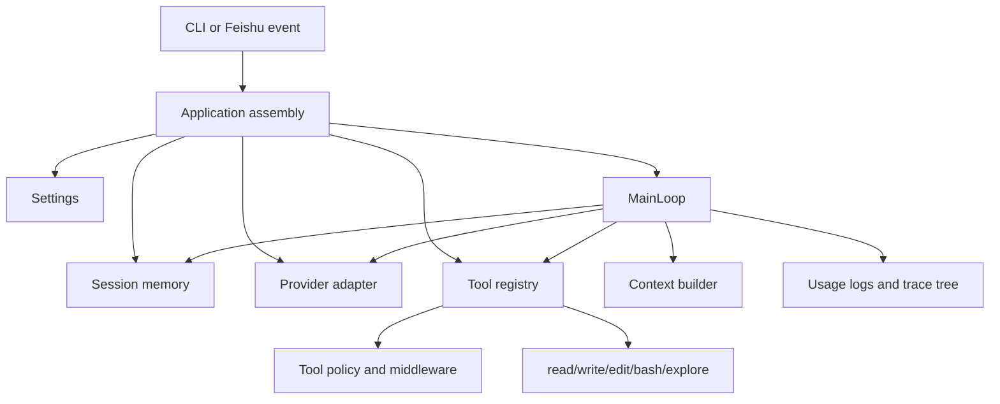

# tiny-claw

[](https://github.com/barry166/tiny-claw/actions/workflows/ci.yml)
[](https://www.python.org/)
[](LICENSE)

`tiny-claw` is a small, readable agent harness for Python CLI agents. It shows
the moving parts behind a coding-agent style runtime: a ReAct loop, provider
adapters, controlled tools, session memory, approval checkpoints, usage
tracking, local trace trees, and a Feishu/Lark event entrypoint.

It is designed as a reference implementation you can read, run, and adapt. The
goal is not to be the biggest agent framework. The goal is to make the core
runtime boundaries clear enough that you can copy the useful pieces into your
own agent, developer tool, or internal automation system.

## Why Star This

- Read the whole agent harness without digging through a giant framework.
- Run the CLI locally with the `echo` provider and no API key.
- See how a model-independent ReAct loop talks to tools and providers.
- Study practical boundaries for tool policies, approval middleware, sessions,
  subagents, usage logs, and JSON trace trees.
- Follow a 30-part guided tutorial series that explains the architecture from
  runtime foundation to production-oriented integrations.
- Copy small examples that work before you configure any model credentials.

## Quickstart

Install dependencies and run a zero-key smoke test:

```bash
uv sync --dev
TINY_CLAW_PROVIDER=echo TINY_CLAW_STATE_DIR=.tmp-state uv run tiny-claw health
TINY_CLAW_PROVIDER=echo TINY_CLAW_STATE_DIR=.tmp-state uv run tiny-claw run --mode think "hello tiny claw"
```

Expected health output:

```text
status=ok
provider=echo
tools=read
state_dir=.tmp-state
```

Expected run output ends with:

```text
hello tiny claw
```

Use a real provider when you want actual model behavior:

```bash
OPENAI_API_KEY=sk-xxx uv run tiny-claw run "explain this project"

ANTHROPIC_API_KEY=sk-ant-xxx \
TINY_CLAW_PROVIDER=claude \
uv run tiny-claw run "explain this project"
```

## What It Includes

| Area | What to look at |
| --- | --- |
| CLI runtime | `tiny-claw health`, `tiny-claw run`, `tiny-claw serve` |
| Agent loop | Model-independent `act`, `think`, `plan`, and `plan-act` modes |
| Providers | OpenAI, Claude/Anthropic, and local `echo` adapters |
| Tools | Read, write, edit, bash, and explorer subagent tools behind an allowlist |
| Safety | Tool middleware, runtime policy, approval checkpoints, and Feishu approval adapter |
| Memory | File-backed session memory for CLI and external event sessions |
| Observability | Usage JSONL, structured logs, and local JSON trace trees |
| Tutorials | A guided architecture course under `docs/tutorial/` |

## Architecture



The public entrypoints stay thin:

- `src/tiny_claw/cli.py` parses commands and delegates to the application.
- `src/tiny_claw/_internal/app.py` wires settings, providers, memory, tools,
  tracing, and the engine.
- `src/tiny_claw/_internal/engine/` owns the main loop and run modes.
- `src/tiny_claw/_internal/provider/` hides vendor SDK differences.
- `src/tiny_claw/_internal/tools/` owns tool contracts, policy, middleware, and
  built-in tools.
- `src/tiny_claw/_internal/integrations/` contains external adapters such as
  Feishu/Lark.

For the full module boundary map, see [docs/ARCHITECTURE.md](docs/ARCHITECTURE.md).

## Run Modes

```bash
uv run tiny-claw run --mode think "analyze this repo without tools"
uv run tiny-claw run --mode plan "create a session plan"
uv run tiny-claw run --mode plan-act --session demo "continue from the plan"
TINY_CLAW_ENABLED_TOOLS=read,write,edit,bash uv run tiny-claw run --mode act "modify README"
```

| Mode | Behavior |
| --- | --- |
| `think` | No tools are exposed. Useful for analysis-only requests. |
| `plan` | Creates or resumes session-scoped `PLAN.md` and `TODO.md` files. |
| `plan-act` | Plans first, then executes the current TODO through the ReAct loop. |
| `act` | Default ReAct execution mode with enabled tools exposed to the model. |

Tools are opt-in through `TINY_CLAW_ENABLED_TOOLS`. The default health check
exposes only the `read` tool.

## Feishu/Lark Event Server

`tiny-claw serve` starts a small HTTP event server:

```text
GET  /health
POST /api/events/feishu
```

Local callback test:

```bash
FEISHU_APP_ID=cli_xxx \
FEISHU_APP_SECRET=xxx \
FEISHU_VERIFICATION_TOKEN=xxx \
FEISHU_ENCRYPT_KEY=xxx \
uv run tiny-claw serve --host 0.0.0.0 --port 8000
```

Expose it with a tunnel such as `ngrok http 8000`, then configure the Feishu or
Lark event subscription URL as:

```text
https://<public-host>/api/events/feishu
```

## Tutorials

The tutorial set is the main learning asset in this repository. It is written in
Chinese today, and structured like a guided architecture course:

- [Zero-key echo provider smoke test](examples/echo-smoke.md)
- [Tutorial index](docs/tutorial/README.md)
- [Opening chapter: from black-box agent to controllable harness](docs/tutorial/00-开篇-从黑盒-agent-到可控-harness.md)
- [Architecture reference](docs/ARCHITECTURE.md)

Recommended reading paths:

- New readers: `00 -> 01 -> 02 -> 03 -> 04`
- Tools and safety: `04 -> 05 -> 06 -> 14 -> 16 -> 17 -> 18 -> 28`
- Production path: `10 -> 18 -> 19 -> 20 -> 21 -> 22 -> 29`
- Subagent path: `23 -> 24 -> 25 -> 26 -> 27 -> 29`

## Configuration

| Variable | Purpose |
| --- | --- |
| `TINY_CLAW_PROVIDER` | `openai`, `claude`, `anthropic`, or `echo`. Defaults to `openai`. |
| `TINY_CLAW_MODEL` | Provider model name. |
| `TINY_CLAW_MAX_TOKENS` | Maximum model output tokens. Defaults to `1024`. |
| `TINY_CLAW_ENABLED_TOOLS` | Comma-separated tool allowlist, for example `read,write,edit,bash`. |
| `TINY_CLAW_STATE_DIR` | State, memory, usage, and trace directory. Defaults to `~/.tiny-claw`. |
| `TINY_CLAW_WORKDIR` | Workspace directory. Defaults to the current directory. |
| `OPENAI_API_KEY` or `OPENAI_KEY` | Required for the OpenAI provider. |
| `ANTHROPIC_API_KEY` or `CLAUDE_KEY` | Required for the Claude/Anthropic provider. |
| `FEISHU_APP_ID` or `LARK_APP_ID` | Required for the Feishu/Lark event endpoint. |
| `FEISHU_APP_SECRET` or `LARK_APP_SECRET` | Required for the Feishu/Lark event endpoint. |
| `FEISHU_VERIFICATION_TOKEN` | Optional event verification token. |
| `FEISHU_ENCRYPT_KEY` | Optional event encryption key. |
| `FEISHU_EVENT_PATH` | Feishu/Lark callback path. Defaults to `/api/events/feishu`. |

Configuration is loaded from the tiny-claw source-tree `.env`, then the current
working directory `.env`, then process environment variables for missing keys.

## Development

```bash
uv sync --dev
uv run ruff check .
uv run ruff format --check .
uv run mypy src
uv run pytest
```

Useful CLI checks:

```bash
uv run tiny-claw --help
uv run tiny-claw run --help
uv run tiny-claw serve --help
TINY_CLAW_PROVIDER=echo TINY_CLAW_STATE_DIR=.tmp-state uv run tiny-claw health
TINY_CLAW_PROVIDER=echo TINY_CLAW_STATE_DIR=.tmp-state uv run tiny-claw run "hello tiny claw"
```

Remove `.tmp-state/` after local smoke tests.

## Who This Is For

`tiny-claw` is useful if you are:

- Building a small coding agent, CLI agent, or internal developer tool.
- Studying how agent loops, tools, memory, approvals, and observability fit
  together.
- Looking for a compact reference before committing to a larger framework.
- Writing architecture notes or tutorials about agent harness design.

It is not trying to be a hosted platform, visual workflow builder, or
drop-in replacement for LangGraph, CrewAI, AutoGen, or the OpenAI Agents SDK.
Those projects are broader. This repo is intentionally narrower and easier to
read.

## Contributing

Small, clear contributions are welcome. Good first areas include:

- Fixing tutorial wording or broken links.
- Adding small examples that run with the `echo` provider.
- Improving error messages and CLI help text.
- Adding focused tests for tool policy, tracing, providers, or session behavior.
- Translating selected tutorial sections into English.

See [CONTRIBUTING.md](CONTRIBUTING.md) and [ROADMAP.md](ROADMAP.md) before
opening a pull request.

## License

MIT. See [LICENSE](LICENSE).
