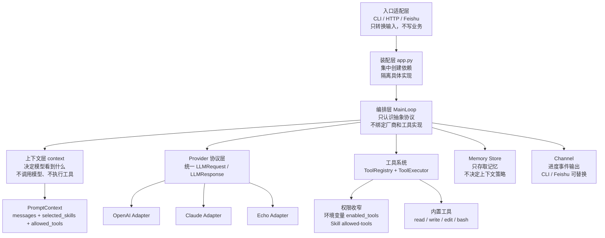

# tiny-claw 架构设计

本文面向项目开发者，说明 `tiny-claw` 为什么这样分层、模块边界在哪里、依赖如何流动，以及后续扩展时应该接入哪一层。

`tiny-claw` 的核心目标不是把所有能力堆进一个 agent 类里，而是把“入口、装配、上下文、编排、工具、模型厂商、外部平台”拆成清晰边界。这样做的收益是：入口可以替换，模型 provider 可以替换，工具可以独立新增，飞书等集成也不会污染主循环。

## 设计原则

- **入口薄**：`cli.py` 和 `server.py` 只把用户输入转换成统一调用，不承载 agent 业务逻辑。
- **装配集中**：`app.py` 是 composition root，集中创建 settings、provider、memory、tools、engine，避免底层模块自己读取环境变量或 new 具体实现。
- **编排稳定**：`engine` 只负责 ReAct 主循环、模式切换和停止条件，不关心 OpenAI/Claude SDK 细节，也不关心工具内部怎么做事。
- **上下文独立**：`context` 只决定“模型本轮看到什么”，不调用模型、不执行工具。
- **工具受控**：`tools` 封装能力，工具是否暴露由 `TINY_CLAW_ENABLED_TOOLS`、active skill 和主循环共同决定。
- **厂商隔离**：`provider` 把内部消息 schema 转换成厂商 SDK 请求，避免 OpenAI/Claude 的请求结构泄漏到 engine。

## 总体架构



这张图里的箭头表达依赖方向：入口调用应用，应用装配主循环，主循环协调上下文、provider、工具、memory 和 channel。具体 SDK、具体工具实现、具体外部平台都在边界外侧，不能反向污染主循环。

## 模块边界

### 入口层：`cli.py` / `server.py`

入口层负责把不同来源的请求转成统一应用调用。

- `cli.py` 解析命令行参数，执行 `health`、`run`、`serve`。
- `server.py` 创建 HTTP 服务，暴露 `/health` 和飞书事件回调入口。
- 飞书事件最终也会落到 `Application.run()`，和 CLI 运行同一套 engine。

这一层不应该直接创建 provider、注册工具、执行工具或拼 prompt。它只负责接入协议和参数转换。未来新增 Slack、Web UI、REST API 时，应优先新增入口适配层，而不是修改 `MainLoop`。

### 装配层：`app.py`

`app.py` 是 composition root。它把运行时依赖集中装配出来：

- `Settings`：从环境变量和 `.env` 读取配置。
- `LLMProvider`：按 provider 名称创建 `EchoProvider`、`OpenAIProvider` 或 `ClaudeProvider`。
- `FileMemoryStore`：创建文件系统记忆存储。
- `ToolRegistry`：按 `TINY_CLAW_ENABLED_TOOLS` 注册工具。
- `MainLoop`：注入 provider、context builder、memory、tools、workdir。

这个设计让 engine 不需要知道配置从哪里来，也不需要知道 provider/tool 具体怎么构造。测试时可以直接注入 fake provider、fake memory、fake tools；外部集成也可以替换 provider，而不改变主循环。

### 上下文层：`context/`

上下文层回答一个问题：**本轮模型应该看到什么？**

当前上下文拼接顺序是：

1. core system prompt：内置最小身份和安全红线。
2. `AGENTS.md`：项目级规范，优先级高于 skill。
3. skill index：列出 `.claw/skills` 中可用 skill 的名称和描述。
4. active skill：显式调用或自动匹配到的当前任务 SOP。
5. recent memory：最近 prompt/response 记忆。
6. user prompt：当前用户输入。

主要模块：

- `ContextBuilder`：兼容入口，供 engine 调用。
- `PromptComposer`：负责按优先级拼装 `PromptContext`。
- `SkillRegistry`：扫描 `.claw/skills/<skill-name>/SKILL.md`，解析 frontmatter 和正文。
- `SkillSelector`：支持 `$skill args`、`/skill args` 显式调用，也支持轻量关键词自动匹配。

上下文层输出的是 `PromptContext`，包括：

- `messages`：发送给 provider 的消息序列。
- `selected_skills`：本轮命中的 skill。
- `skill_arguments`：显式 skill 调用时传入的参数。
- `allowed_tools`：active skill 声明的工具收窄范围。

它不调用 provider，也不执行工具。这样可以保证“模型看到什么”和“系统能做什么”分离。

Skill 权限有一条关键规则：`allowed-tools` 只能收窄工具，不能提升权限。最终可见工具来自 `TINY_CLAW_ENABLED_TOOLS`，如果 active skill 声明了非空 `allowed-tools`，再取交集；如果 skill 没写 `allowed-tools`，就不额外限制。

### 编排层：`engine/`

`engine` 是 agent 的控制流核心。它不处理 CLI 参数、不解析 HTTP、不直接理解 OpenAI/Claude SDK，也不关心工具内部实现。

主要模块：

- `MainLoop`：管理 run 生命周期、轮次、模式、停止条件。
- `ToolExecutor`：执行模型返回的 tool calls，并生成 tool observation。
- `Channel`：把运行进度发给 CLI、Feishu 或其他外部通道。
- `log_view`：把主循环、模型响应、工具调用渲染成可读日志。

`MainLoop` 支持三种模式：

- `act`：默认 ReAct 执行模式，模型可以看到工具定义并调用工具。
- `think`：隐藏工具定义，只允许模型分析，不执行工具。
- `plan-act`：第 1 轮是 `plan`，隐藏工具完成规划；后续轮次是 `act`，暴露工具并执行。

主循环的关键步骤：

1. 读取 recent memory。
2. 调用 `ContextBuilder` 生成 `PromptContext`。
3. 计算本轮最终可见工具。
4. 请求 `LLMProvider.complete()`。
5. 如果 assistant 没有 tool calls，记录记忆并返回最终结果。
6. 如果有 tool calls 且当前阶段允许工具，则交给 `ToolExecutor`。
7. 把工具结果作为 `Role.TOOL` message 追加回消息列表，进入下一轮。

如果模型在 `think` 或 `plan` 阶段返回工具调用，主循环会阻止执行，并以 `tool_policy_blocked` 停止。这是为了保证“隐藏工具”的模式语义不被模型绕过。

### 工具层：`tools/` 与 `ToolExecutor`

工具层把外部能力封装为统一 `Tool` 协议。每个工具提供：

- `name`：暴露给模型的工具名。
- `description`：给模型看的工具说明。
- `parameters`：JSON Schema 风格参数。
- `run()`：实际执行逻辑。

`ToolRegistry` 只负责注册、查找和调用工具。当前内置工具包括：

- `read`：读取工作区文件。
- `write`：写入文件。
- `edit`：局部替换文件内容。
- `bash`：在工作区内执行终端命令。

工具暴露遵循双层控制：

1. 全局开关：`TINY_CLAW_ENABLED_TOOLS`。默认只启用 `read`。
2. Skill 收窄：active skill 的非空 `allowed-tools`。

`ToolExecutor` 负责执行模型返回的 tool calls。`read` 被视为并行安全，可以批量并发；`write`、`edit`、`bash` 默认顺序执行，避免副作用互相干扰。

工具失败不会直接让主循环崩溃。`ToolExecutor` 会把 `ToolError` 转成 `is_error=True` 的 tool observation，让模型有机会读取错误并自我修正。

### Provider 层：`provider/`

Provider 层负责厂商适配。engine 只认识内部协议：

- `LLMRequest`
- `LLMResponse`
- `Message`
- `ToolDefinition`
- `ToolCall`

具体 provider 负责把这些内部结构转换成厂商 SDK payload：

- `openai.py`：适配 OpenAI Chat Completions。
- `claude.py`：适配 Claude Messages API。
- `echo.py`：默认本地 provider，不需要 API key，用于开发和冒烟测试。
- `base.py`：定义 provider-neutral 协议。

这个边界的价值是：新增 provider 时只实现 `LLMProvider.complete()` 和消息转换，不需要改 engine、context 或 tools。

### Memory 层：`memory/`

Memory 层当前是轻量文件系统存储。

- `FileMemoryStore.append()` 追加 JSONL 记录。
- `FileMemoryStore.read_recent()` 读取最近 N 条记忆。
- `MainLoop` 在 run 结束时记录 `last_prompt` 和 `last_response`。

Memory 不决定哪些内容进入模型上下文。它只提供数据；是否注入、怎么注入由 context 层决定。

当前 memory 不承诺向量检索、长期摘要、自动 compact 或知识图谱。未来如果要升级，也应保持“存储/检索”和“上下文装配策略”分离。

### 外部集成层：`integrations/feishu/`

飞书集成是外部平台适配层。

- `FeishuEventAdapter` 接收飞书 webhook，提取文本消息。
- `FeishuSdkMessageSender` 负责向飞书会话发送文本。
- `FeishuChannel` 实现 engine `Channel` 协议，接收开始、思考、工具调用、工具结果、完成等进度事件。

飞书层不直接调用工具、不直接访问 provider，也不拼上下文。它只把外部事件转换为 `Application.run()`，再把 engine 事件转回飞书消息。

这个设计让未来接入其他平台时可以复用 `Application` 和 `MainLoop`，只新增平台 adapter 和 channel。

## 主要运行链路

### CLI `run`

```text
tiny-claw run
  -> cli.py 解析参数
  -> build_application(settings)
  -> Application.run()
  -> MainLoop.run()
  -> ContextBuilder.build()
  -> Provider.complete()
  -> ToolExecutor.run_tool_calls() 可选
  -> 返回 RunResult
```

### Feishu `serve`

```text
飞书 webhook
  -> server.py HTTP endpoint
  -> FeishuEventAdapter._on_message()
  -> Application.run(channel=FeishuChannel)
  -> MainLoop.run()
  -> FeishuChannel 推送进度与最终回复
```

## 扩展指南

- 新增命令入口：优先改 `cli.py`，保持业务逻辑落到 `Application` 或内部模块。
- 新增外部平台：在 `integrations/` 下新增 adapter 和 channel，不改 `MainLoop`。
- 新增工具：实现 `Tool` 协议，在 `app.py` 的工具装配中注册，并通过 `TINY_CLAW_ENABLED_TOOLS` 显式启用。
- 新增模型厂商：在 `provider/` 下实现 `LLMProvider`，把内部 schema 转换成厂商请求。
- 新增上下文能力：优先扩展 `context/`，让其输出 `PromptContext`，不要在 engine 里散落 prompt 拼接逻辑。
- 新增 skill：创建 `.claw/skills/<skill-name>/SKILL.md`。如需限制工具，写 `allowed-tools`；不写则不限制当前全局工具。

## 当前明确不做的事情

- 不支持全局 skill 目录或插件市场。
- 不支持向量记忆、长期摘要或自动 compact。
- 不让 skill 执行隐式命令。
- 不让 provider SDK 结构穿透到 engine。
- 不让入口层直接操作 tools/provider/context。
